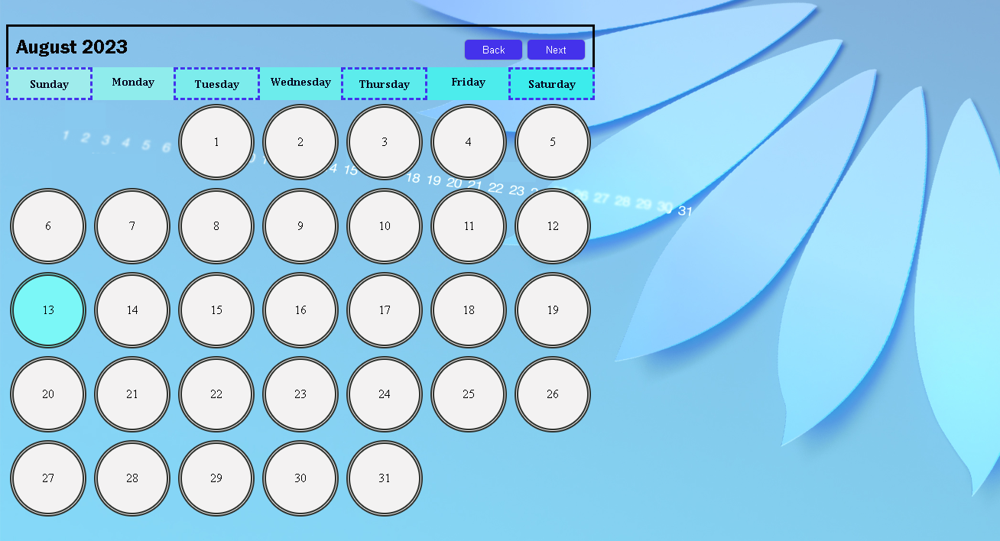
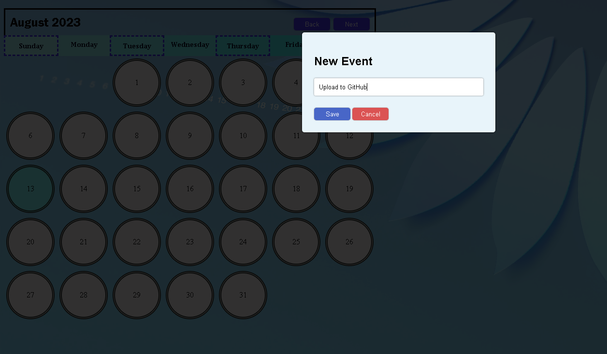
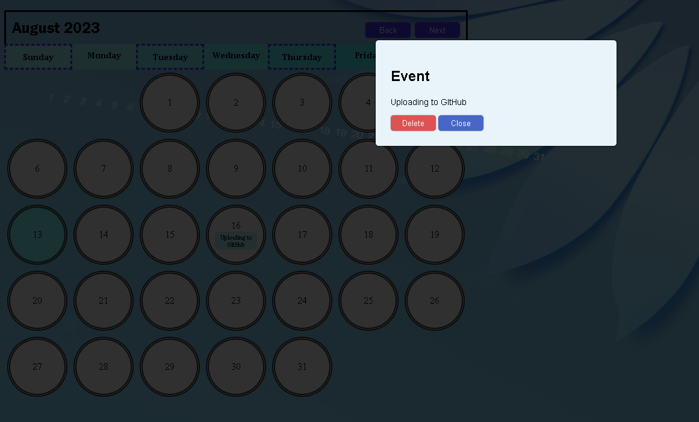

# Calendar App
This is a simple calendar app that allows you to view and manage events for different days.

## Features

- Display a calendar with navigational buttons to switch between months.
- Click on a date to open a modal to add or delete events for that date.
- Events are saved using local storage, so they persist across sessions.

## Usage

The calendar displays the current month by default.

Use the "Back" and "Next" buttons to navigate between months.

Click on a date to open the event modal.

If an event exists for the selected date, the event title will be displayed, and you can choose to delete the event.

If no event exists for the selected date, you can add a new event by entering the event title and clicking "Save."

